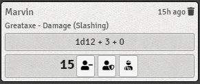

# Chat Damage Buttons (5e)

This module replaces the right-click context menu with buttons on the dice-roll chat message.

Current Issues:
- styling is sub-optimal
- the dice-tooltip event is also triggered when a button is clicked

If you have any suggestions or feedback, please contact me on discord (@hooking#0492)