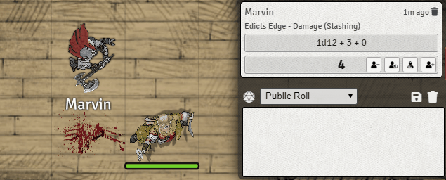

# Simple Chat Damage Buttons (5e)

A fork of [Chat Damage Buttons by Hooking](https://gitlab.com/hooking/foundry-vtt---chat-damage-buttons/-/tree/master).

The old project was out of date and didn't work with v0.7.9 of FoundryVTT.

This module replaces the right-click context menu with buttons on the dice-roll chat message.

### Installation Instructions

To install a module, follow these instructions:

1. Review the [FoundryVTT Wiki for installing modules](https://foundryvtt.wiki/en/basics/Modules)
2. Provide the following manifest url: https://raw.githubusercontent.com/Yidna/fvtt-simple-chat-damage-buttons/master/module.json 

### Feedback

If you have any suggestions or feedback, feel free to create an [Issue on Github](https://github.com/Yidna/fvtt-simple-chat-damage-buttons/issues)